# Using synthetic sampling techniques for deep features in the classification of imbalanced datasets

<!-- Please contact me via email to request the source code for this project. -->
$${\color{red}Please \space contact \space me \space via \space email \space to \space request \space the \space source \space code \space for \space this \space project.}$$

## Table of Contents

- [About Project](#about-project)
- [Description](#description)
- [Feature](#feature)
- [Result](#result)
- [Technologies](#technologies)

## About Project

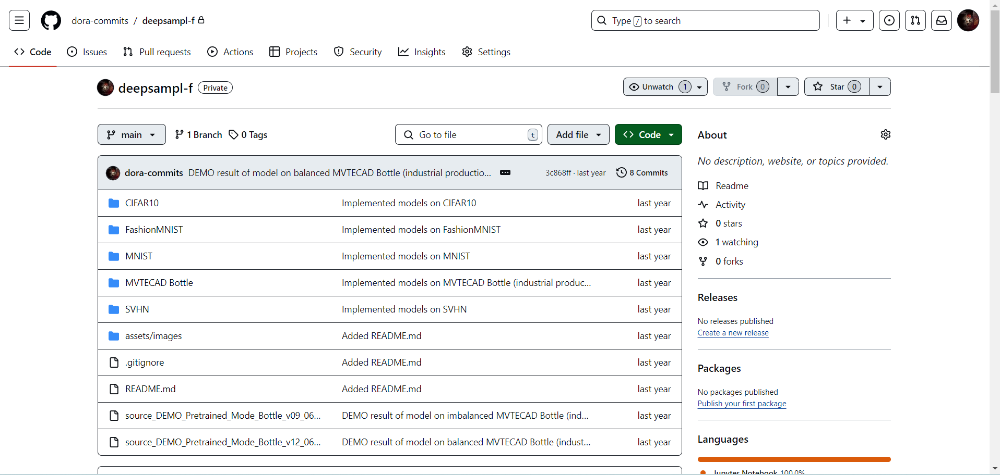
 
**Folder tree of project.**
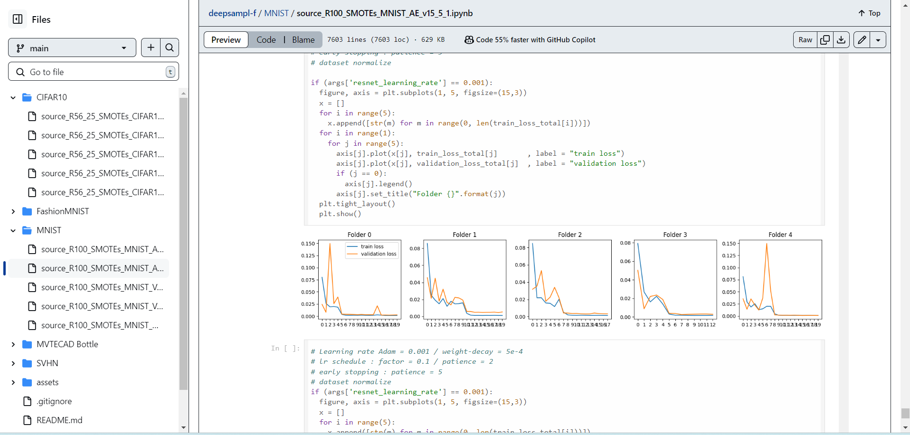
 
**Result of classification on imbalanced dataset.**
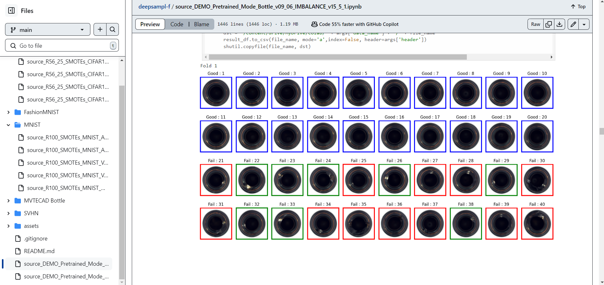
 
**Result of classification on balanced dataset after using synthetic sampling techniques for deep features in classification of imbalanced datasets.**
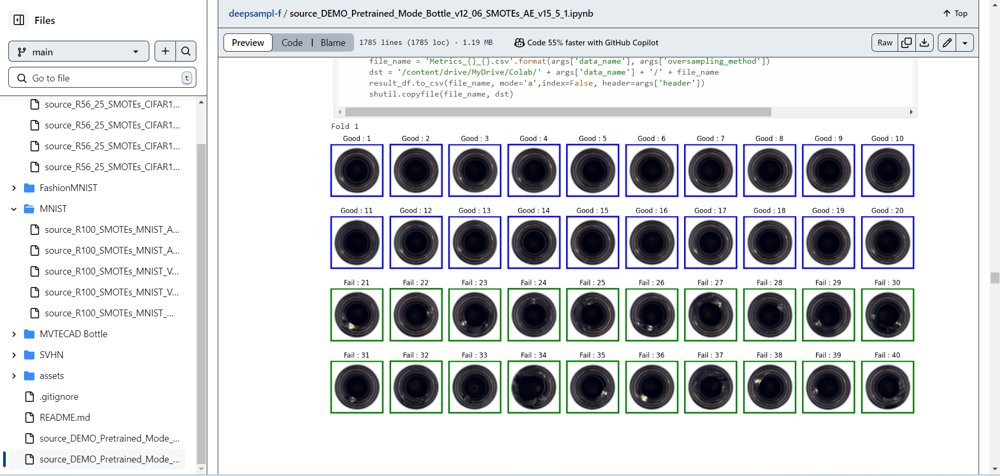

## Description
Built and optimized **classification models** for imbalanced datasets by integrating 3 **convolutional autoencoder** variants (AE, VAE, WAE) with synthetic sampling techniques(**SMOTE**, **ADASYN**). Enhanced classification performance across 4 **large scale image datasets**, resulting in detection accuracy for **industrial production defects** increasing from **70%** in imbalanced conditions to **97.5%** after optimization.

## Feature

| Feature                               | Details     | 
|---------------------------------------|-------------|
| *Data Preprocessing*| • Utilized large image datasets such as MNIST, FashionMNIST, CIFAR-10, and SVHN, each containing 60,000 samples and 10 classes.   • Applied 5-fold cross-validation to rigorously assess classification models and their performance metrics.  • Developed the MVTECAD Bottle dataset with 300 samples and 2 classes for industrial defect detection through systematic extraction and annotation.   • Partitioned datasets into 20% independent test sets and imbalanced sets, with MVTECAD Bottle having 13% as independent test sets.|
| *Balancing Data based on train-generate process*| Balanced imbalanced sets across 10 models with convolutional autoencoder variants for deep feature extraction, SMOTE and ADASYN for sample balancing, incorporating penalty.|
| *Classification model*| • Split balanced data into 80% training and 20% validation sets for classification models.   • Built and optimized classification models using ResNet18, ResNet34, ResNet50, and ResNet152 architectures.   • Applied Weight Decay to prevent overfitting and Early Stopping with a patience of 5 to avoid overtraining. | 
| *Evaluation and Data visualization*| • Evaluated model performance on independent test datasets using 3 metrics: Accuracy, F1 Score, and Geometric Mean.  • Analyzed confusion matrices for accuracy and misclassifications across 10 classes (MNIST, FashionMNIST, CIFAR-10, SVHN) and 2 classes (MVTECAD Bottle).   • Visualized true/false predictions for 40 cases of MVTECAD Bottle in the independent test set.|
| *Optimize Time*| To optimize prediction time on the test dataset, each model is divided into two stages:   - Stage 1: Perform training with deep features and generate balanced data samples. Then, build and save the classification model.   - Stage 2: Deploy the classification model from Stage 1 to evaluate it on the test dataset.|

## Result

| Datasets                               | Details     | 
|---------------------------------------|-------------|
| MNIST | SMOTE-AE model achieved 96.48% accuracy. |
| FashionMNIST and SVHN | SMOTE-AE+Penalty model demonstrated superior performance. |
| CIFAR-10 | ADASYN-VAE+Penalty model yielded the best results. |
| **MVTECAD Bottle** (industrial production defect) | SMOTE-AE model improved accuracy to 97.50%, compared to 70% without synthetic sampling based on deep features. Under ideal conditions, the model's accuracy could potentially reach 100%. |

- Image generated based on 10 models with autoencoder variants for deep feature extraction, SMOTE and ADASYN for sample balancing, incorporating penalty.
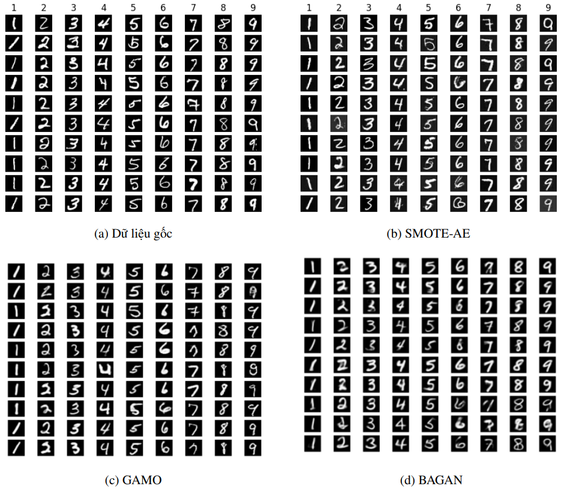
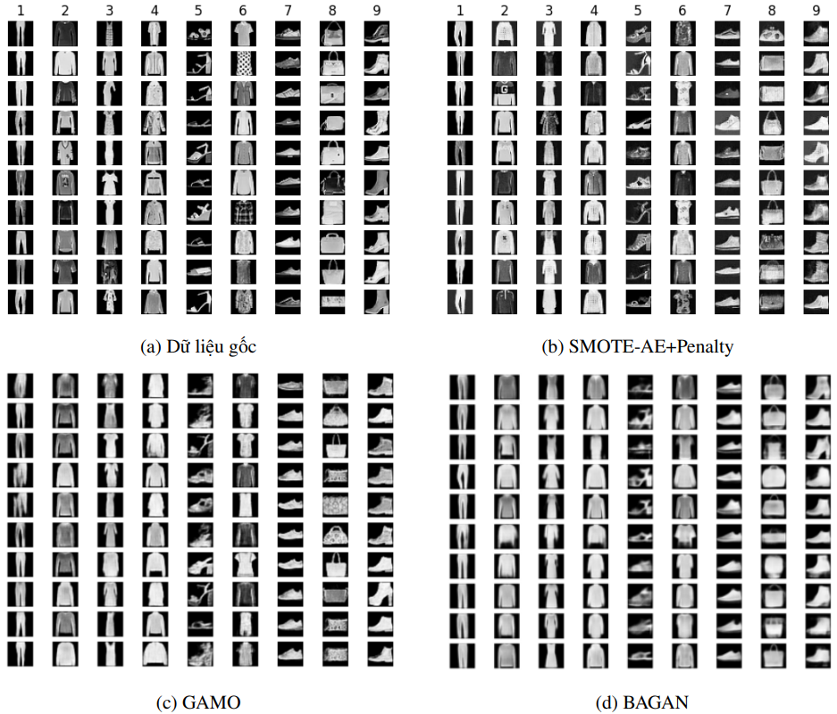
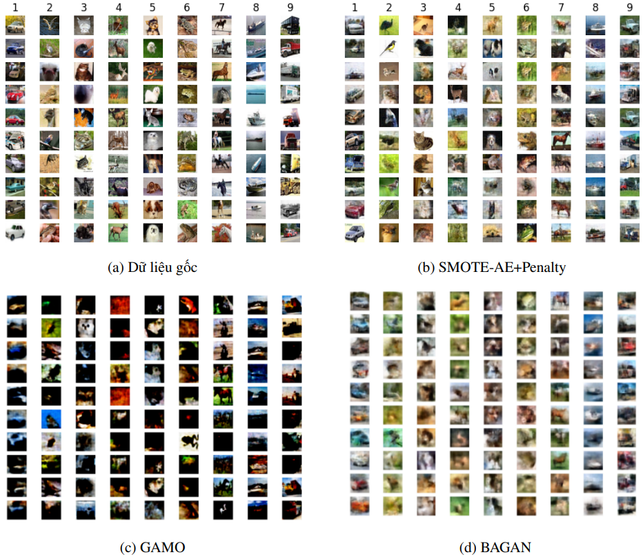
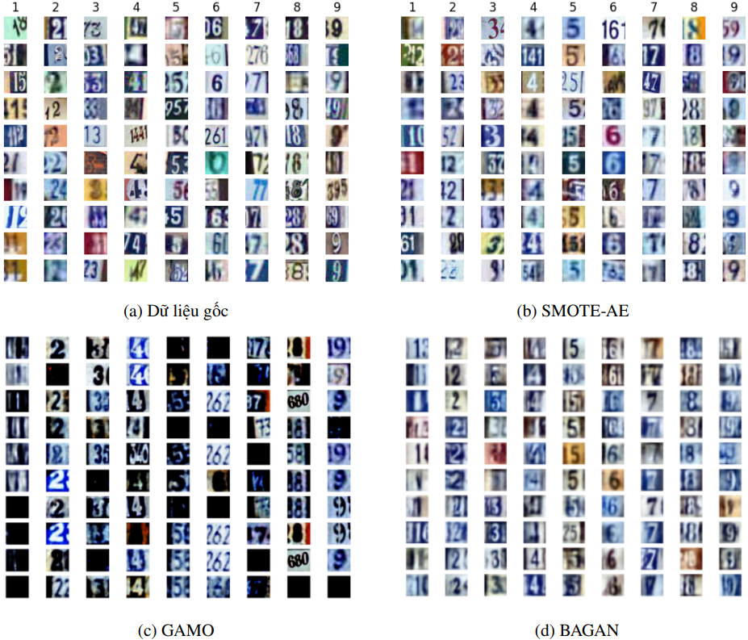

- Result classification model on *imbalanced dataset* (**MVTECAD Bottle** (industrial production defect)).
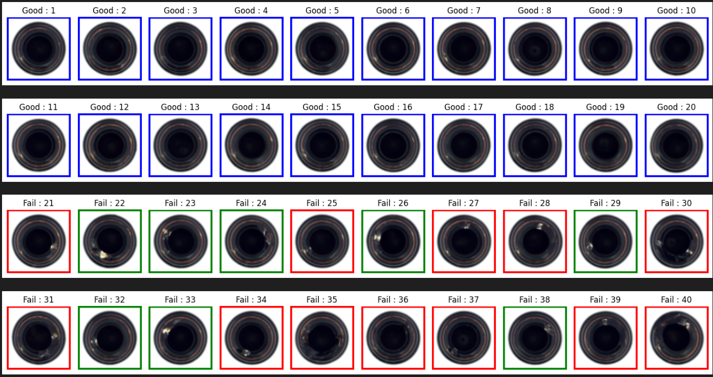  
- Result classification model on *balance dataset* (**MVTECAD Bottle** (industrial production defect)) after using synthetic sampling techniques for deep features in classification of imbalanced datasets.
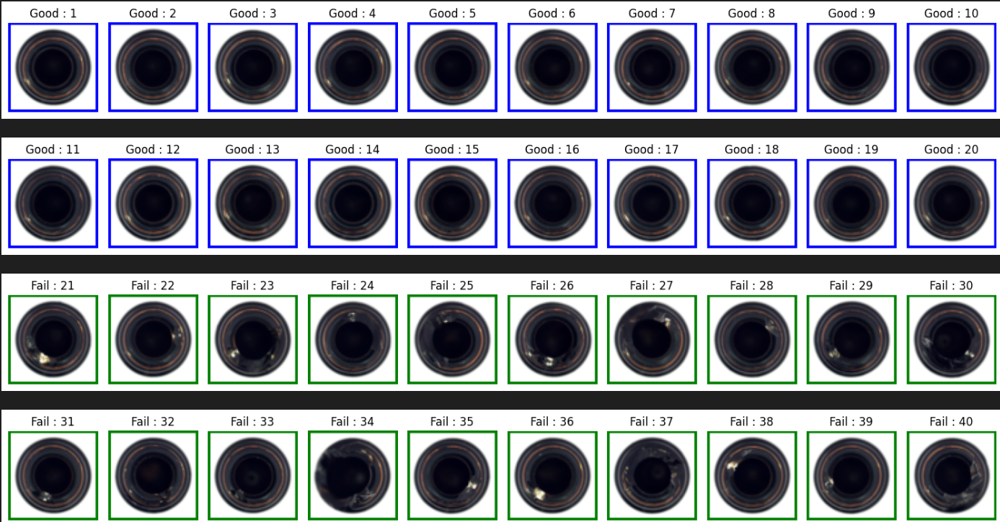  

- Result (metrics) classification model on *balance dataset* (**MVTECAD Bottle** (industrial production defect)) after using synthetic sampling techniques for deep features in classification of imbalanced datasets.
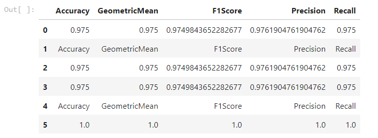

## Technologies

| Category                               | Tools/Technologies     | 
|---------------------------------------|-------------|
| *Programming* | Python |
| *Frameworks* | PyTorch, TensorFlow |
| *Libraries* | - Scikit-learn (1.2.2)  - NumPy (1.22.4)  - sklearn-pandas (2.2.0)  - Torchvision (0.15.1+cu118)  - Pandas (1.5.3)  - Matplotlib (3.7.1)  - Seaborn (0.12.2)  - SciPy (1.10.1)|
| *AutoEncoder variants* | AE, VAE, WAE |
| *Classification* | ResNet, optimizer (Adam, SGD)|
| *Environment* | Google Colab (for development and code execution) |

